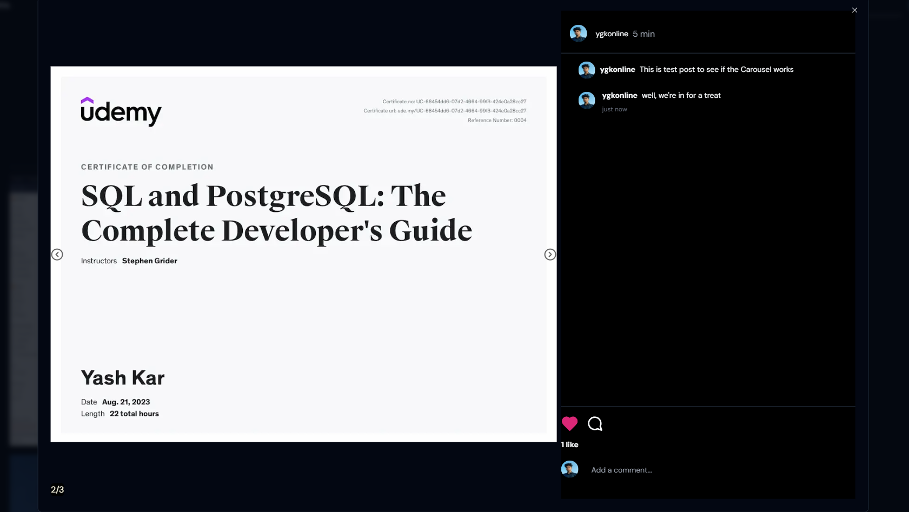
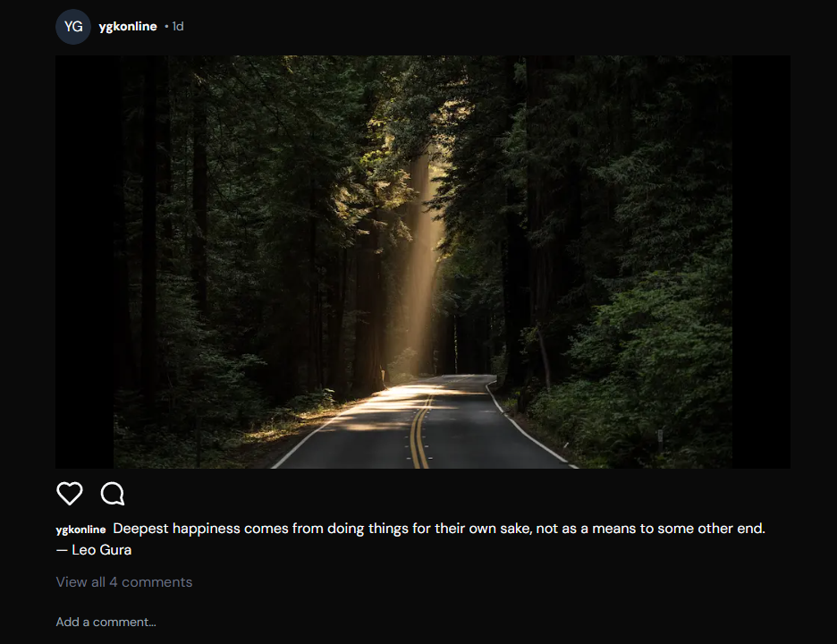

<h1 align="center">Trinsta</h1>

> A clone of Instagram made using Next.js, Tailwind CSS and Server Components: Using the uploadThing API and components from Shadcn-ui with added metadata tags.

## 📸 Screenshots

#### Carousel

#### Search by User or Username

### Double tap to like a post

#### Skeleton UI for major pages

#### Fallback UI for loading user dp

#### Edit Profile

#### Post Loading and View States

#### Custom Errors

#### Delete post for the author

## Tech Used

- [Next.js](https://nextjs.org)
- [NextAuth.js](https://next-auth.js.org)
- [Prisma](https://prisma.io)
- [Shadcn-ui](https://ui.shadcn.com)
- [Tailwind CSS](https://tailwindcss.com)
- [tRPC](https://trpc.io)
- [Uploadthing](https://uploadthing.com)
