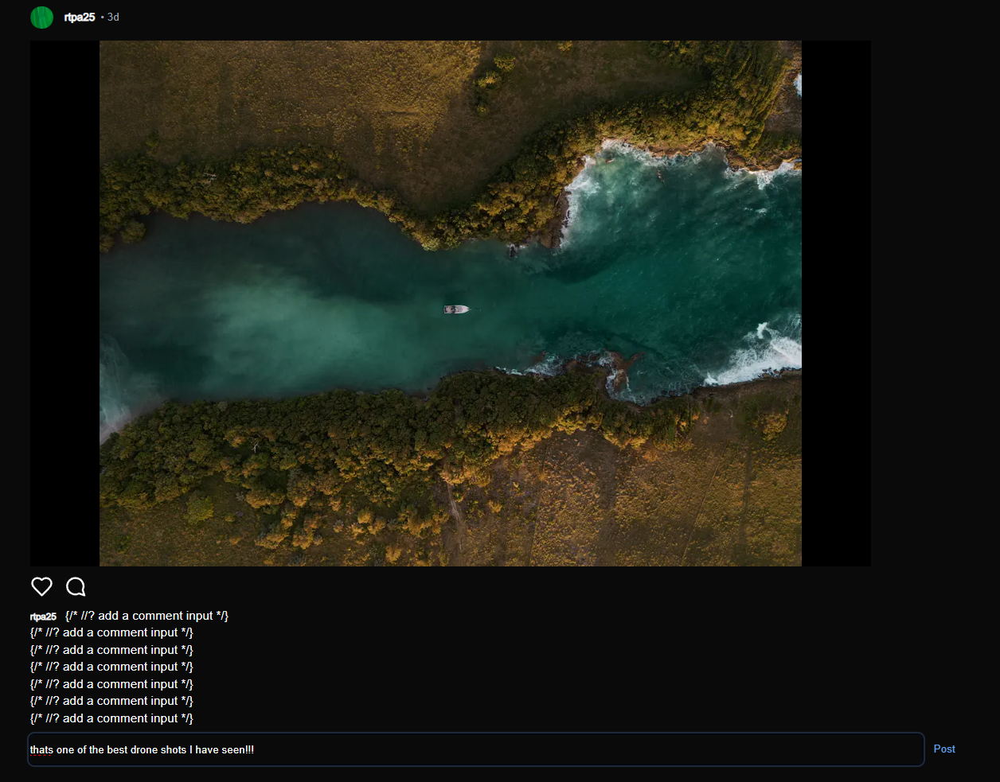
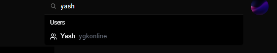
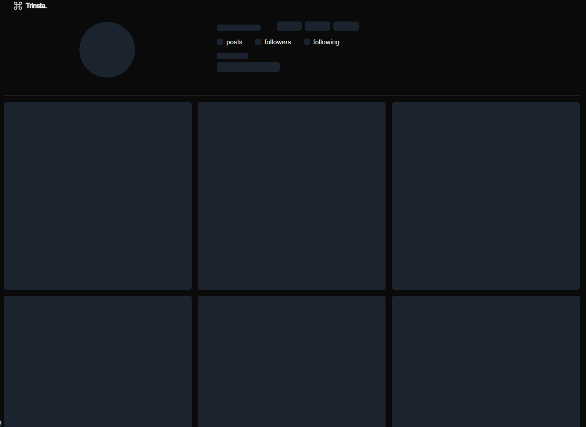
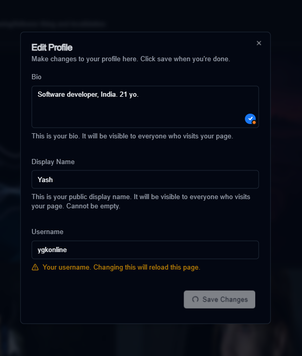
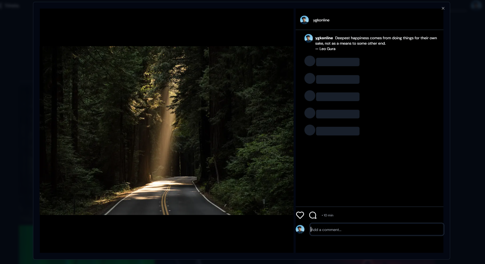
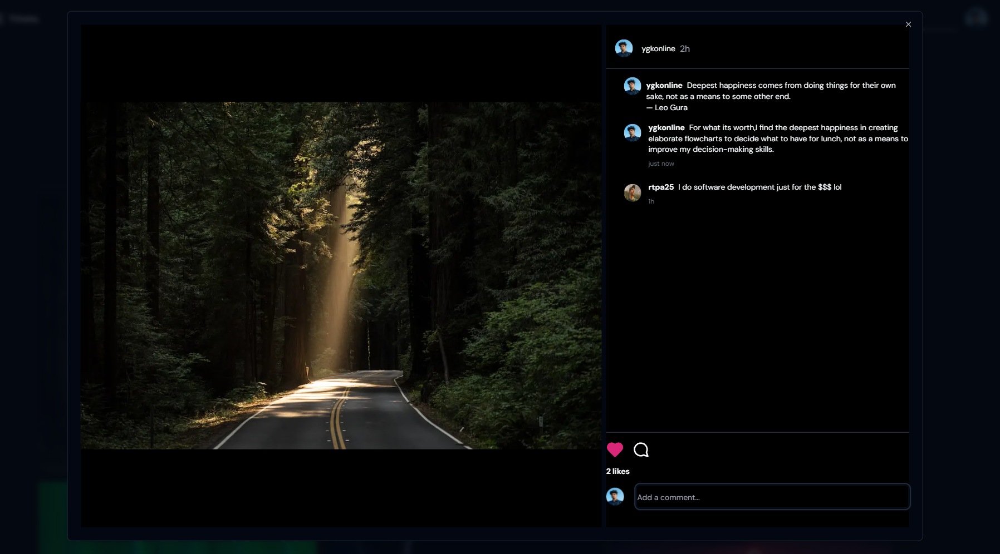
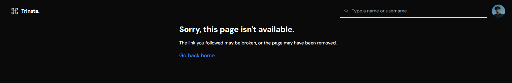

<h1 align="center">Trinsta</h1>

> A clone of Instagram made using Next.js, Tailwind CSS and Server Components: Using the uploadThing API and components from Shadcn-ui with added metadata tags.

## 📸 Screenshots

[](https://trpc-insta.vercel.app)

#### Search by User or Username



#### Skeleton UI for major pages



#### Edit Profile



#### Post Loading and View States




#### Custom Errors



## Tech Used

- [Next.js](https://nextjs.org)
- [NextAuth.js](https://next-auth.js.org)
- [Prisma](https://prisma.io)
- [Tailwind CSS](https://tailwindcss.com)
- [tRPC](https://trpc.io)
- [Shadcn-ui](https://ui.shadcn.com)

### 1. Clone the repository

```bash
git clone https://github.com/sadmann7/netflx-web
```

### 2. Install dependencies

```bash
yarn install
```

### 3. Create a `.env` file

Create a `.env` file in the root directory and add the environment variables as shown in the `.env.example` file.

### 4. Run the application

```bash
yarn run dev
```
